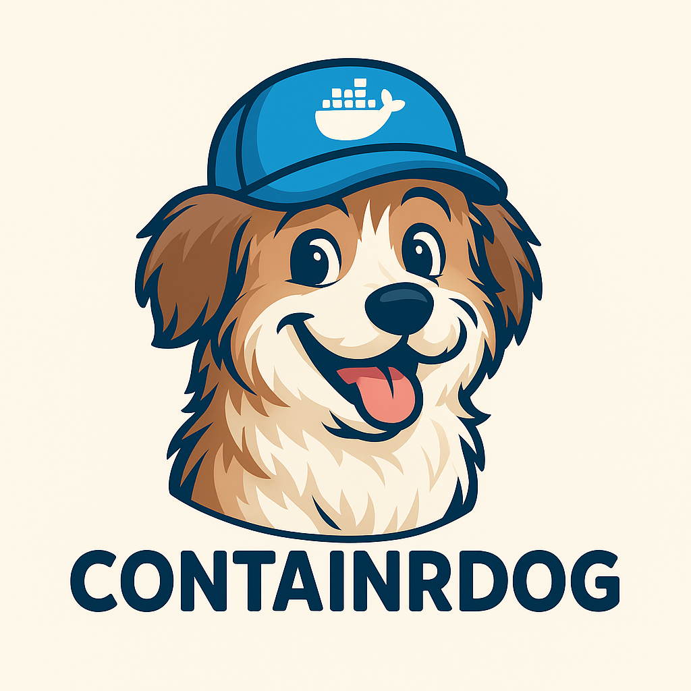

<div align="center">
  

  # ContainrDog 🐕

  **Automated container image update monitor for Docker, Podman, and Kubernetes**

  Periodically checks for new image versions and executes custom commands when updates are detected.

  ---
</div>

## Features

- **Multi-runtime**: Docker, Podman, and Kubernetes
- **Update detection**: Semantic versioning and digest-based
- **Policy-based**: `all`, `major`, `minor`, `patch`, `force`, `glob`
- **Auto-update**: Pull and recreate containers (or patch K8s workloads) automatically
- **Pre/post hooks**: Run commands before and after updates
- **Webhooks**: Slack, Discord, Teams, generic
- **GitOps**: Monitor a Git repo and run commands on changes
- **Private registries**: Docker Hub, GHCR, ECR, custom

## Quick Start

```bash
# Docker Compose (recommended)
docker-compose up -d

# Docker
docker run -d \
  --name containrdog \
  -v /var/run/docker.sock:/var/run/docker.sock:ro \
  -e INTERVAL=5m \
  ghcr.io/vaggeliskls/containrdog

# Kubernetes
docker run -d \
  --name containrdog \
  -e RUNTIME=kubernetes \
  -e K8S_NAMESPACES=default,production \
  -v ~/.kube/config:/root/.kube/config:ro \
  ghcr.io/vaggeliskls/containrdog
```

Label your containers to opt in (when `LABELED=true`):
```yaml
labels:
  - containrdog-enabled=true
```

For Kubernetes, use annotations on your Deployment/StatefulSet/DaemonSet:
```yaml
metadata:
  annotations:
    containrdog-enabled: "true"
```

## Documentation

| Topic | Description |
|-------|-------------|
| [Examples](docs/examples.md) | Full working examples for Docker and Kubernetes |
| [Runtimes](docs/runtimes.md) | Docker, Podman, and Kubernetes setup |
| [Helm Chart](docs/helm.md) | Deploy on Kubernetes with Helm |
| [Configuration](docs/configuration.md) | All environment variables |
| [Update Policies](docs/update-policies.md) | `major`, `minor`, `patch`, `force`, `glob` |
| [Labels & Annotations](docs/labels.md) | Per-container control |
| [Hooks](docs/hooks.md) | Pre/post update commands |
| [Webhooks](docs/webhooks.md) | Slack, Discord, Teams notifications |
| [GitOps](docs/gitops.md) | Git-based config management |
| [Registries](docs/registries.md) | Private registry authentication & ECR |
| [Development](docs/development.md) | Local dev and project structure |

## License

MIT
